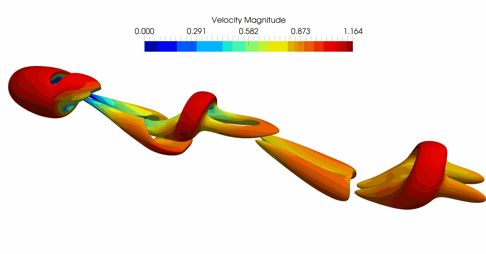
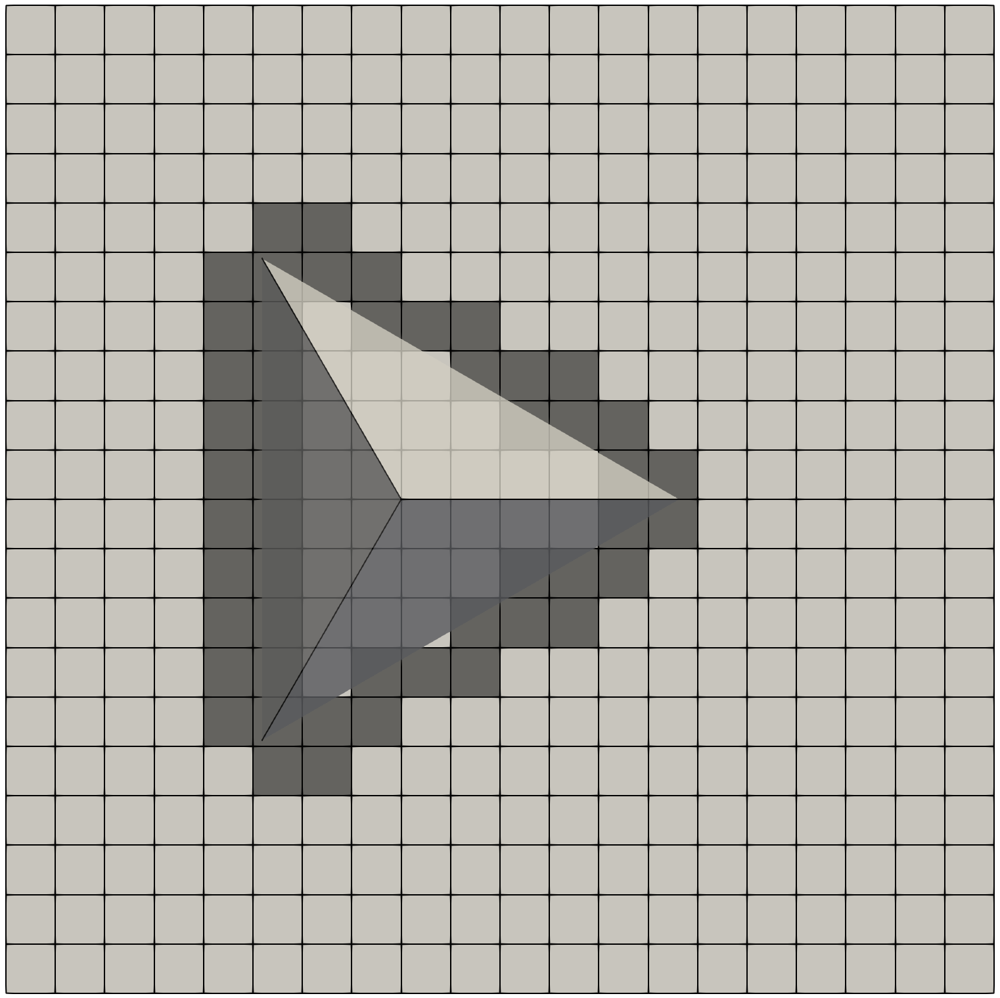
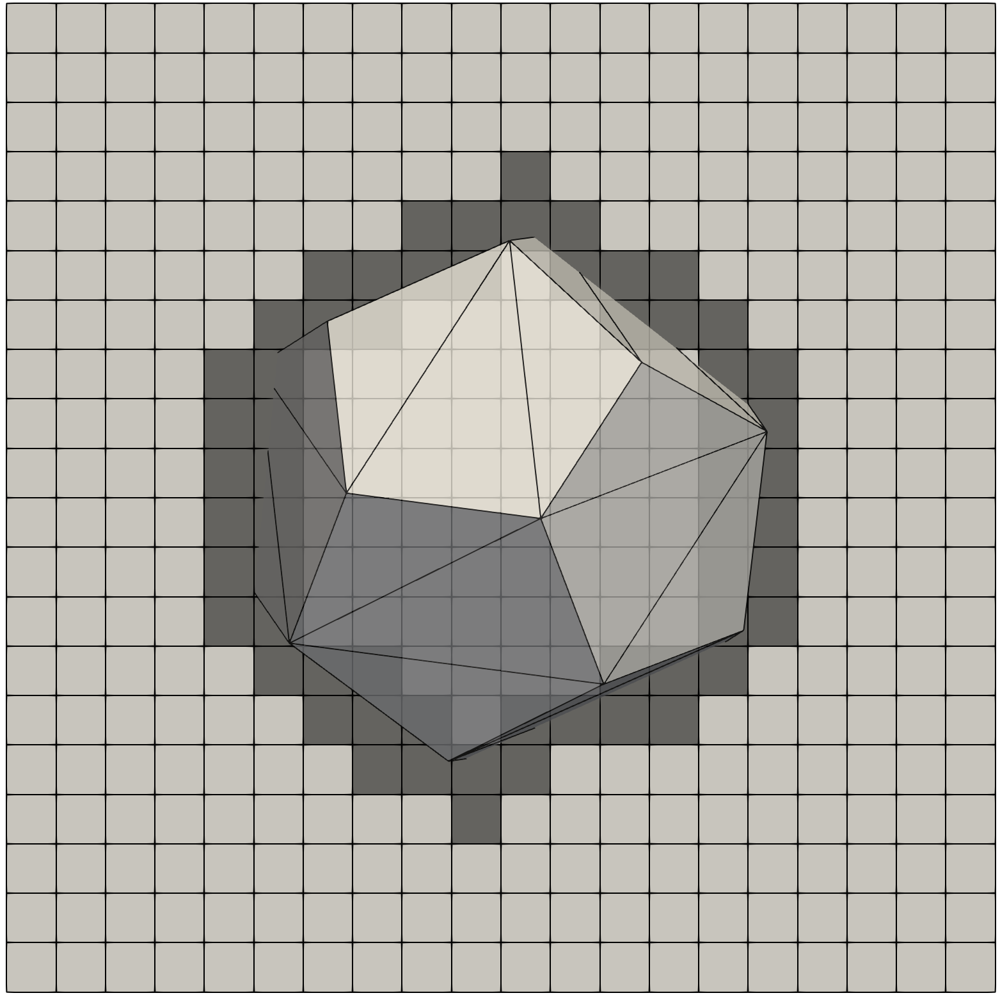
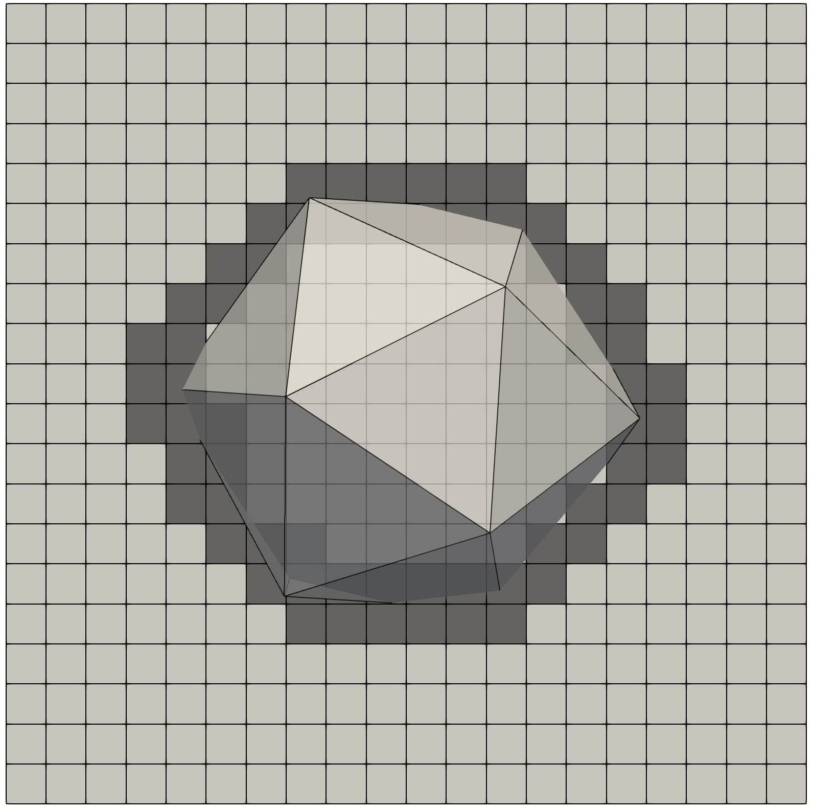
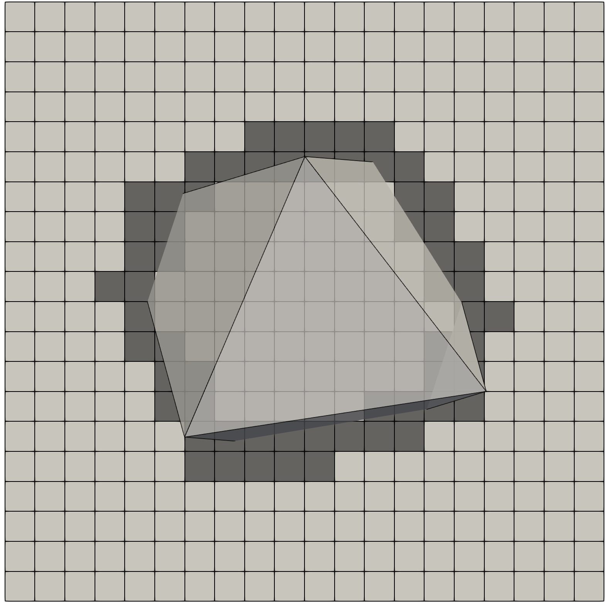
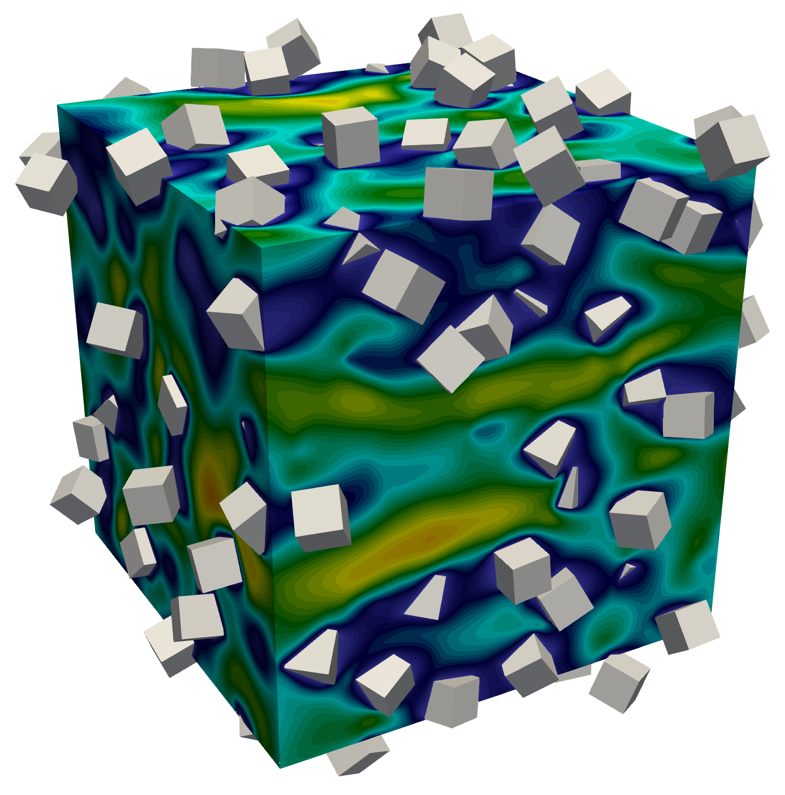
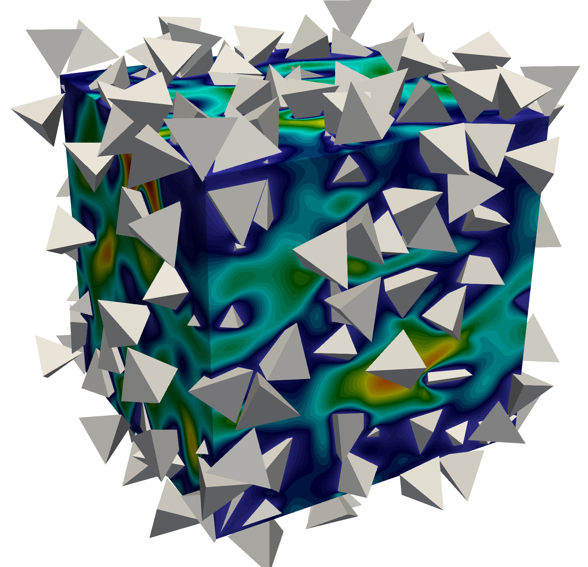

 
I am a Ph.D. candidate in my final year working with <a href="https://personal.math.ubc.ca/~wachs/" target="_blank">Dr. Anthony Wachs</a> at the University of British Columbia. My research interests involve the mathematical modeling of complex flow problems on High Performance Computing (HPC) platforms. I have developed a fast and scalable code to solve non-linear Partial Differential equations for fluid flows containing non-spherical rigid bodies as part of my doctoral research. I have over 8 years of experience developing high-performance code in C/C++ and FORTRAN, specializing in scientific computing, programming, and transport phenomena with applications in the food, pharmaceutical, and oil-gas industries.

 
Computational/Colorful Fluid Dynamics (CFD)

 
I developed a code to solve the non-linear Navier-Stokes equation in a domain with rigid structures. The rigid bodies can be any shape defined by the user, and the code solves the flow around that rigid structure. The code is written in C++ using an object-oriented framework that enables users to add more functionality conveniently. It will soon be open-sourced for anyone to use. The code has been rigorously tested and written using good coding practices. I used HPC platforms to answer increasingly tough problems in order to demonstrate the code's speed, scalability, and accuracy. Here are a few examples of flow configurations that I solved using my code.

 
I began with a simple flow configuration involving just one sphere. I validated my code by recreating the results from the literature for flow past a sphere at Re = 300. The animation below demonstrates regular votex shedding, as expected:

 
The figures below show how particles of different shapes are recognized on the flow grid. The flow near the particle surface requires advance corrections in the shaded area. The correction assures the sharp fluid-solid interface with second-order space accuracy.

Tetrahedron | Dodecahedron | Icosahedron | Octahedron
:-------------------------:|:-------------------------:|:-------------------------:|:-------------------------:
 |  |  | 

 
Having non-spherical shapes like those seen above is complex enough, but I add more rigid particles to increase the complexity. The two figures below show the code capabilities to handle unpredictable configurations of non-spherical particles. In both examples, if looked at closely enough, one can see the flow intricacies.

Flow past multiple cubes | Flow past multiple tetrahedrons
:-------------------------:|:-------------------------:
 | 

 
It is critical to test the robustness and competence of your code by pushing it to its limits. The image below depicts the flow through 150,000 rigid spherical particles that are randomly created. Each sphere is adequately resolved on the computational grid (i.e. the results are not affected by the size of the flow grid). This test case solves 27 billion variables on 7000 cores at every time-iteration. The amount of useful data produced by this simulation is equivalent to 60 simulations based on any other algorithm.

Zoomed data | All data
:-------------------------:|:-------------------------:
 | 

 
With the collaboration of my labmate (Dr. Antoine Morente), we generalized the code so the user could define any rigid body in Standard Triangulation Language (STL) format. The code reads each triangle defining the geometry and solves the flow inside or outside the geometry. The animation below shows flow past the great Jabba. This shows how the code can also handle the shapes defined by complex triangular structures. Truth to be told, we did this because it looks cool. It's good to have some fun at work!

| Jabba the Great |
|:-------------------------------:|
|  |